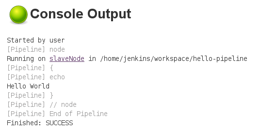
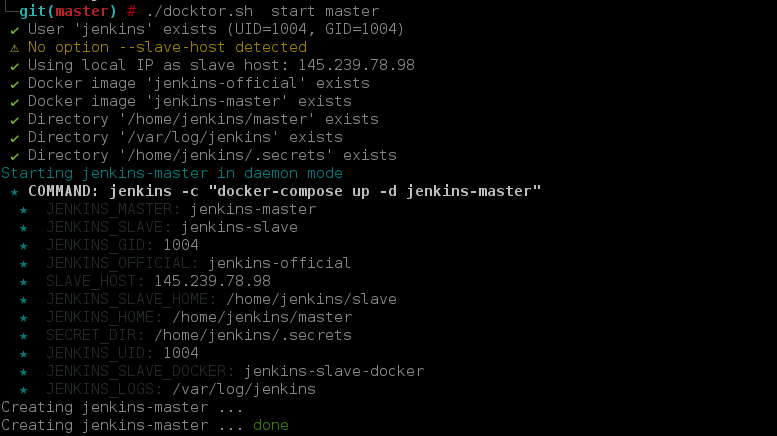

# DocktorCI
DocktorCI is a template project for a scripted and dockerized Jenkins installation. It is mainly designed for a **personal use** but stay generic.

**Benefits:**
 - Ease the installation of a jenkins master with a jenkins slave (ssh)
 - Allow to preserve a clean git repository of your jenkins configuration
 - Use of Docker images for master and slave
 - No workaround for the jenkins UID/GID (official image is build to suit your environment)
 - The slave include a Docker client, so you can start other containers inside your pipeline
 - You don't need Docker Hub account, images are build on the fly

**Tech Stack**


## Installation

### Prepare the target host(s)

You can install master and slave on the same host, or on different ones. In all cases you have to install some tools on these hosts:
 - git
 - [docker CE](https://docs.docker.com/engine/installation/#server)
 - [docker-compose](https://docs.docker.com/compose/install)

You will also have to create a jenkins user (adjust options depending your needs)

```sh
# whoami: root

# Add a jenkins user, in the Docker group 
useradd jenkins --create-home --home /home/jenkins --shell /bin/bash -G docker

# Create secrets directories, here already created and showed for the example

# Your admin jenkins account
cat /home/jenkins/.secrets/jenkins/admin
sampleAdminLogin:myPassword

# Your artifactory account (to push snapshot/release artifacts)
cat /home/jenkins/.secrets/jenkins/artifactory
login:pwd

# Your ssh priv and pub keys here for master/slave communication
ls /home/jenkins/.secrets/jenkins/slave
 - id_rsa
 - id_rsa.pub

# Your ssh priv and pub keys here for your access to gitlab (account to checkout)
ls /home/jenkins/.secrets/jenkins/gitlab
 - id_rsa
 - id_rsa.pub

# Example to generate RSA keys for jenkins master/slave communication (no passphrase)
ssh-keygen -f /home/jenkins/.secrets/jenkins/slave/id_rsa -N ""

# Secure your .secrets directory and assign it to the jenkins user
chmod -R go-rwx /home/jenkins/.secrets && chown -R jenkins:jenkins /home/jenkins/.secrets

# create a log directory
mkdir /var/log/jenkins && chown jenkins:jenkins /var/log/jenkins
```

### Checkout this project

You can checkout this project anywhere, /home/jenkins will be used here. 
```bash
# whoami: jenkins
# pwd:    /home/jenkins
git clone https://github.com/ylacaute/docktorci.git && cd docktorci
```
The script **docktor.sh** will help you to control your jenkins master and slave.


### Start Jenkins master
The first time you run the script, it is simpler to run it as root to create all missing stuff like directories.
```bash
./docktor.sh start master
```
The first time you start master/slave, images will have to be build. The master build need the slave host IP. By default the script takes the first IP given from the ```hostname -I``` which is usually the good one to use when you run the slave on the same host of the master. If it is not the case, you still can specify it. 
```bash
./docktor.sh -r --slave-host <YOUR_SLAVE_IP> start master
```

### Start Jenkins slave
If you want your slave on another host, you have to checkout this project as well.
```bash
./docktor.sh start slave
```
As for the master, images will have to be build the first time you start it. The slave images take longer to build.

### Connect to your jenkins IHM
You should now able to connect to <yourHostIP>:8042 and log in as your defined admin password.
A simple hello-world pipeline is already created. 

If you start a build, you will see it is executed on the slave node:




## Documentation

### SSH
By default, master and slave communication is done with SSH on port 2222. This is not parametrable but you can
easily change it by yourself (node config + docker-compose config).

### Logging
Logs are accessible in **/var/log/jenkins/jenkins.log** by default.

### Rebuild image
The script allow the -r option when starting master or slave: with this option it will also force to rebuild 
docker images.

**After a rebuild:** keep in mind all running containers (slave and master) are shutting down, you will have to restart them. Just take a look at ```docker ps``` to see what is running. 

Also, when you update Jenkins configuration by rebuilding the Jenkins image, you often as to remove everything in jenkins home directory in order to make changes. For now, you have to remove it manually.
You can safely remove everything in Jenkins home, but be sure to extract job configuration for example because they will be lost and recreated from the base configuration in the git repository. 

### Tips & tricks
After installing a plugin, you can extract the updated plugins list from the jenkins console. 
```groovy
jenkins.model.Jenkins.instance.getPluginManager().getPlugins().each {
  println "${it.getShortName()}"
}
```

## Backlog

- [ ] __Auto-sync jobs__ add option to copy config.xml of all manually created jobs
- [ ] __Auto-sync plugins__ add option to extract and save plugins as plugins.txt

## Screenshots


