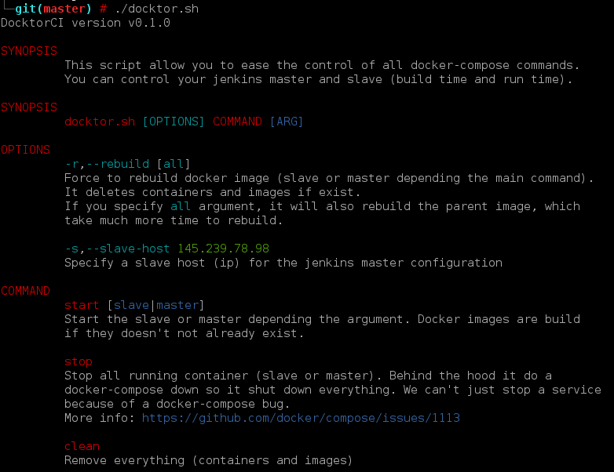
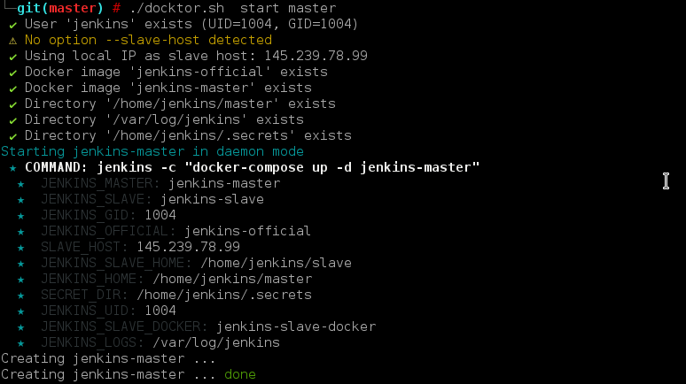

# DocktorCI
DocktorCI is a template project for a scripted and dockerized Jenkins installation. It is mainly designed for a **personal use** but stay generic.

benefits:
 - ease the installation of a jenkins master with a jenkins slave (ssh)
 - allow to keep a clean repository of your jenkins configuration
 - use of Docker images for master and slave
 

## Installation

### Prepare the target host(s)

You can install master and slave on the same host, or on different ones. In all cases you have to install some tools on these hosts:
 - git
 - [docker CE](https://docs.docker.com/engine/installation/#server)
 - [docker-compose](https://docs.docker.com/compose/install)

You will also have to create a jenkins user (adjust options depending your needs)

```bash
# whoami: root

# Add a jenkins user, in the Docker group 
useradd jenkins --create-home --home /home/jenkins --shell /bin/bash -G docker

# Create secrets directories, here already created and showed for the example
cat /home/jenkins/.secrets/jenkins/admin
sampleAdminLogin:myPassword

cat /home/jenkins/.secrets/jenkins/artifactory
login:pwd

# You have to create key here with ssh-keygen (or copy existing ones)
ls /home/jenkins/.secrets/jenkins/slave
 - id_rsa
 - id_rsa.pub

# You have to create key here with ssh-keygen (or copy existing ones)
ls /home/jenkins/.secrets/jenkins/gitlab
 - id_rsa
 - id_rsa.pub

# Example to generate RSA keys for jenkins master/slave communication (no passphrase)
ssh-keygen -f /home/jenkins/.secrets/jenkins/slave/id_rsa -N ""

# Secure your .secrets directory and assign it to the jenkins user
chmod -R go-rwx /home/jenkins/.secrets && chown -R jenkins:jenkins /home/jenkins/.secrets

# create a log directory
mkdir /var/log/jenkins && chown jenkins:jenkins /var/log/jenkins
```

### Checkout this project

You can checkout this project anywhere, /home/jenkins will be use here. 
```bash
# whoami: jenkins
# pwd:    /home/jenkins
git clone https://github.com/ylacaute/docktorci.git && cd docktorci
```
This script **docktor.sh** will help you to control your jenkins master and slave.


### Start Jenkins master
The first time you run the script, it is simpler to run it as root to create all missing directories.
```bash
./docktor.sh start master
```
The first time you start Jenkins, images will have to be build. During this build you need to specify the slave
host IP. The script will take the first IP given from the ```hostname -I``` command which is usually the good one to
use. If it is not the case, you still can specify it: 
```bash
./docktor.sh -r --slave-host <YOUR_SLAVE_IP> start master
```

### Start Jenkins slave
```bash
./docktor.sh start slave
```
As for the master, images will have to be build the first time you start it. The slave images take longer to build.

### Connect to your jenkins IHM
You should now able to connect to <yourHostIP>:8042 and log in as your defined admin password.
A simple hello-world pipeline is already created. 


## Documentation

### SSH
By default, master and slave comminucation is done with SSH on port 2222. This is not parametrable but you can
easily change it by yourself (node config + docker-compose config).

### Logging
Logs are accessible in **/var/log/jenkins/jenkins.log** by default.

### Rebuild image
The script allow the -r option when starting master or slave: with this option it will also force to rebuild 
docker images.

### Tips & tricks
After installing a plugin, you can extract the updated plugins list from the jenkins console. 
```groovy
jenkins.model.Jenkins.instance.getPluginManager().getPlugins().each {
  println "${it.getShortName()}"
}
```

## Screenshots


